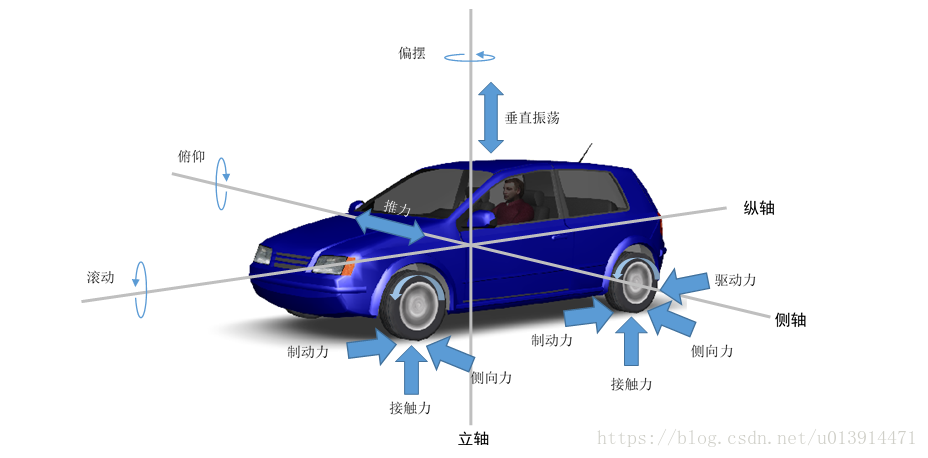
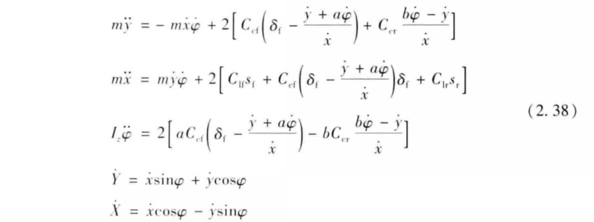

## 2.1 车辆动力学模型

动力学主要研究作用于物体的力与物体运动的关系，车辆动力学模型一般用于分析车辆的平顺性和车辆操纵的稳定性。对于车来说，研究车辆动力学，主要是研究车辆轮胎及其相关部件的受力情况。比如纵向速度控制，通过控制轮胎转速实现；横向航向控制，通过控制轮胎转角实现。

正常情况下，车辆上的作用力沿着三个不同的轴分布：

1.纵轴上的力包括驱动力和制动力，以及滚动阻力和拖拽阻力作滚摆运动；
2.横轴上的力包括转向力、离心力和侧风力，汽车绕横轴作俯仰运动；
3.立轴上的力包括车辆上下振荡施加的力，汽车绕立轴作偏摆或转向运动
原文链接：https://blog.csdn.net/u013914471/article/details/83018664

车辆单轨模型：

在XYZ右手系坐标系上，其受/力分析如下：
$$
\begin{cases} ma_x = 2F_{xf} + 2F_{xr} \\ ma_y = 2F_{yf} + 2F_{yr} \\ I_z\ddot\varphi = 2aF_{yf} -2bF_{yr} \end{cases}\quad\quad\quad\quad(1-1)
$$

横向加速度由两部分组成：
$$
a_y = \ddot y + \dot x\dot\varphi \quad\quad\quad\quad\quad(1-2)
$$
同理，纵向加速度也可分解为：
$$
a_x = \ddot x - \dot y\dot\varphi\quad\quad\quad\quad\quad\quad(1-3)
$$
所以
$$
\begin{cases} m(\ddot x - \dot y\dot\varphi) = 2F_{xf} + 2F_{xr} \\ m(\ddot y + \dot x\dot\varphi) = 2F_{yf} + 2F_{yr} \\ I_z\ddot\varphi = 2aF_{yf} -2bF_{yr} \end{cases}
$$
移项可得：

$$
\begin{cases} m\ddot x = m\dot y \dot\varphi + 2F_{xf} + 2F_{xr} \\ m\ddot y = -m\dot x \dot\varphi + 2F_{yf} + 2F_{yr} \\ I_z\ddot\varphi = 2aF_{yf} -2bF_{yr} \end{cases}\quad\quad\quad\quad\quad\quad(1-4)
$$

一般来说两坐标系间转换满足一个映射关系，如xoy向loe坐标转换则满足如下规则：
$$
\left[\begin{matrix} v_l \\ v_e \end{matrix}\right] = \left[\begin{matrix} \sin\delta , \cos\delta\\ cos\delta,-\sin\delta \end{matrix}\right]\cdot \left[\begin{matrix} v_y \\ v_x \end{matrix}\right]
$$
前轮滑移角：
$$
\alpha_f = \delta_f - \theta_{Vf}
$$
后轮滑移角：
$$
\alpha_r = -\theta_{Vr}
$$
由图可知
$$
\tan\theta_V = \frac{v_e}{v_l}
$$

$$
\theta_V \approx \tan\theta_V = \frac{v_e}{v_l}
$$

其中：
$$
\begin{cases} v_{yf} = \dot y + a\dot\varphi \\ v_{yr} = \dot y - b\dot\varphi \\ v_{xf} = \dot x \\ v_{xr} = \dot x \end{cases}
$$
代入坐标变换：
$$
\left[\begin{matrix} v_{fl} \\ v_{fe} \\ v_{rl} \\ v_{re} \end{matrix}\right] = \left[\begin{matrix} \sin\delta_f , \cos\delta_f , 0 ,0 \\ cos\delta_f,-\sin\delta_f ,0 ,0 \\ 0,0,\sin\delta_r , \cos\delta_r\\ 0,0, cos\delta_r,-\sin\delta_r \end{matrix}\right]\cdot \left[\begin{matrix} v_{yf} \\ v_{xf} \\ v_{yr} \\ v_{xr} \end{matrix}\right]  = \left[\begin{matrix} \sin\delta_f , \cos\delta_f , 0 ,0 \\ cos\delta_f,-\sin\delta_f ,0 ,0 \\ 0,0,\sin\delta_r , \cos\delta_r\\ 0,0, cos\delta_r,-\sin\delta_r \end{matrix}\right]\cdot \left[\begin{matrix} \dot y + a\dot\varphi \\ \dot x \\ \dot y - b\dot\varphi  \\ \dot x \end{matrix}\right]
$$
经试验，当侧偏角及纵向滑移率较小时，可将轮胎纵侧向受力公式线性化表示，即：
$$
\begin{cases} F_l = C_ls \\ F_e=C_e\alpha \end{cases}
$$
假设theta极小，则：
$$
\left[\begin{matrix} v_{fl} \\ v_{fe} \\ v_{rl} \\ v_{re} \end{matrix}\right] = \left[\begin{matrix} \sin\delta_f , \cos\delta_f , 0 ,0 \\ cos\delta_f,-\sin\delta_f ,0 ,0 \\ 0,0,\sin\delta_r , \cos\delta_r\\ 0,0, cos\delta_r,-\sin\delta_r \end{matrix}\right]\cdot \left[\begin{matrix} \dot y + a\dot\varphi \\ \dot x \\ \dot y - b\dot\varphi  \\ \dot x \end{matrix}\right] = \left[\begin{matrix} \delta_f,1,0,0\\1,-\delta_f,0,0\\0,0,\delta_r,1\\0,0,1,-\delta_f \end{matrix}\right]\cdot\left[\begin{matrix} \dot y + a\dot\varphi \\ \dot x \\ \dot y - b\dot\varphi  \\ \dot x \end{matrix}\right] = \left[\begin{matrix} \dot x \\ \dot y + a\dot\varphi \\ \dot x \\ \dot y - b\dot\varphi \end{matrix}\right]
$$
所以：
$$
\theta_{Vf} = \frac{\dot y + a\dot\varphi}{\dot x}
$$

$$
\theta_{Vr} = \frac{\dot y - b\dot\varphi}{\dot x}
$$

so
$$
\alpha_f = \delta_f - \theta_{Vf} = \delta_f - \frac{\dot y + a\dot\varphi}{\dot x}
$$

$$
\alpha_r = -\theta_{Vr} = \frac{b\dot\varphi - \dot y}{\dot x}
$$

then
$$
F_{ef} = C_{ef}(\delta_f - \frac{\dot y + a\dot\varphi}{\dot x})\\F_{er} = C_{er}(\frac{b\dot\varphi - \dot y}{\dot x})
$$

then

